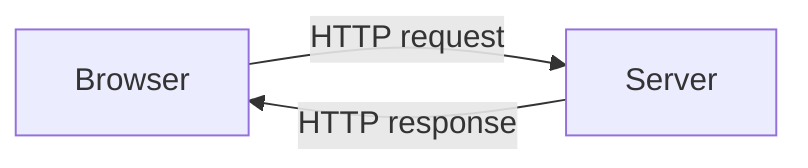

---
# Stable UUID — generated automatically. Do NOT change.
id: 038bf4ed-abc5-457d-a038-4af960648049
title: "First Lesson"
# Optional: estimated reading time in minutes
estimated_minutes: 5
---

# First Lesson

This is the first lesson of your course. Replace the content below with your own.

## What you'll learn

- Concept one
- Concept two
- Concept three

## Main content

Write your lesson content here using regular Markdown. Code blocks, lists,
images and links are all supported automatically.

```python
def hello(name: str) -> str:
    return f"Hello, {name}!"
```

### Callouts (Obsidian native syntax)

> [!info] Information
> Useful for tips and clarifications. The full set of Obsidian callout
> types is supported: note, info, tip, warning, danger, success, question,
> example, quote, todo, and more.

> [!warning] Be careful
> Use warnings for things students should pay attention to.

> [!hint]- Click to expand
> The minus after the type makes the callout collapsed by default.
> Use `+` for expanded foldable callouts.

### Diagrams

Mermaid diagrams use the standard fenced code block:



### Wiki-links and embeds

You can link to other lessons in the course using Obsidian wiki-link
syntax (or standard markdown links — both work):

- `[[../block-2/lesson-1]]` — link to another lesson
- `[[../block-2/lesson-1|see the next chapter]]` — with custom label
- `![[../assets/diagram.png]]` — embed an image

## Try it yourself

Embed an inline quiz that pulls a question from `questions.yaml`:

> [!quiz] example-question

## Coding challenge

Reference a coding challenge defined in `challenges/`:

<!-- > [!challenge] example-challenge -->

## Summary

Wrap up the key takeaways from this lesson.
